# 1. Цель работы

Получение навыков правильной работы с репозиториями git: освоение Gitflow, Conventional Commits, семантического версионирования.

# 2. Задание

1. Установить git-flow, Node.js, pnpm.
2. Установить commitizen et standard-changelog.
3. Создать репозиторий git-extended.
4. Настроить Conventional Commits.
5. Инициализировать git-flow.
6. Créer les releases 1.0.0 et 1.2.3.

# 3. Выполнение лабораторной работы

## 3.1. Installation

### 3.1.1. git-flow
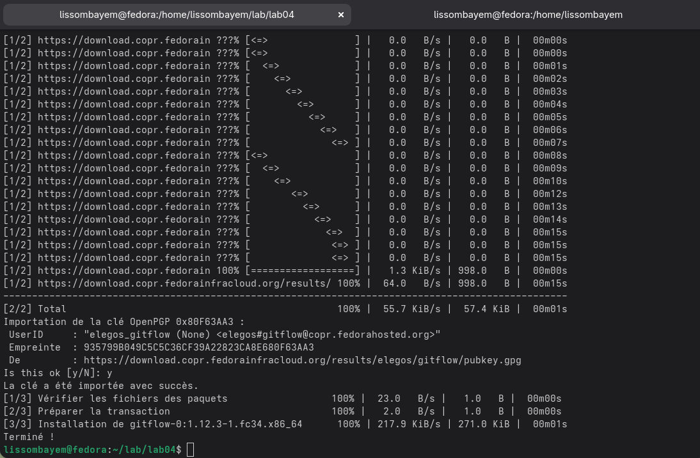

### 3.1.2. Node.js
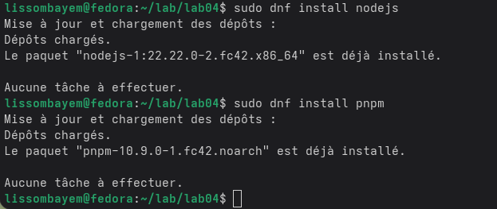

### 3.1.3. commitizen
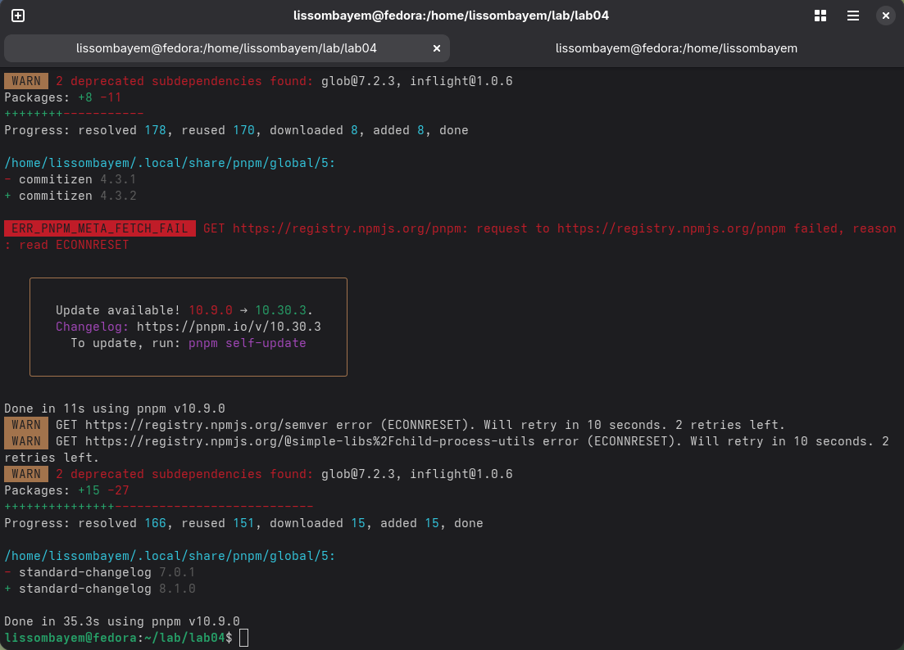

## 3.2. Création du dépôt
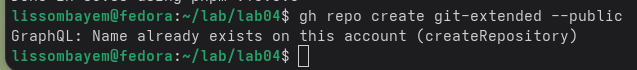
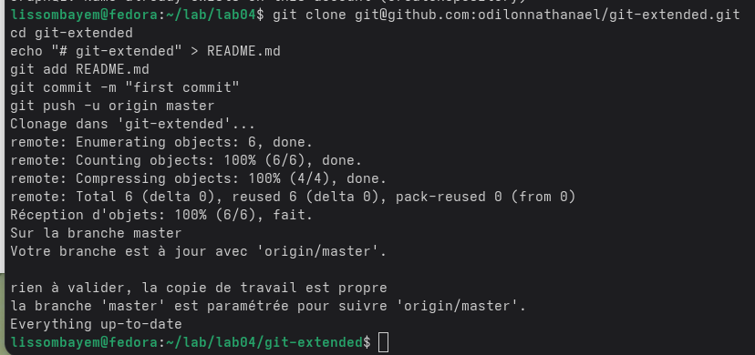

## 3.3. Configuration package.json
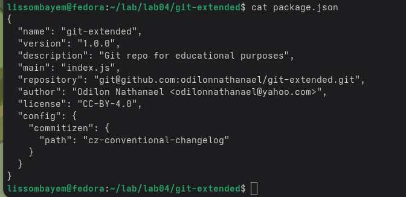

## 3.4. Commit avec commitizen
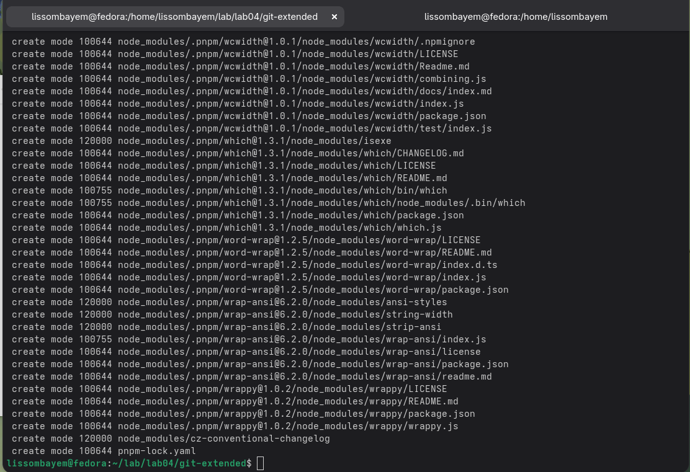

## 3.5. Initialisation git-flow
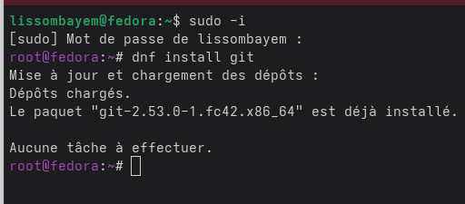

## 3.6. Release 1.0.0
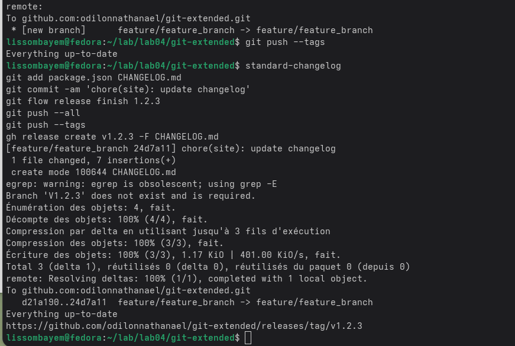

## 3.7. Feature
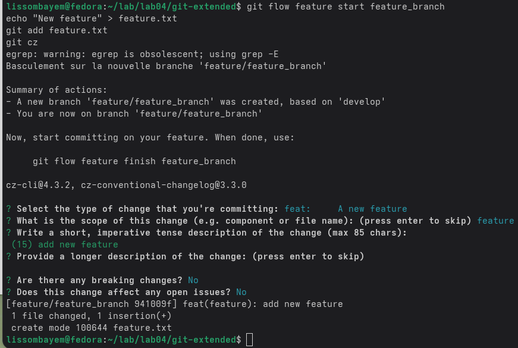

## 3.8. Release 1.2.3
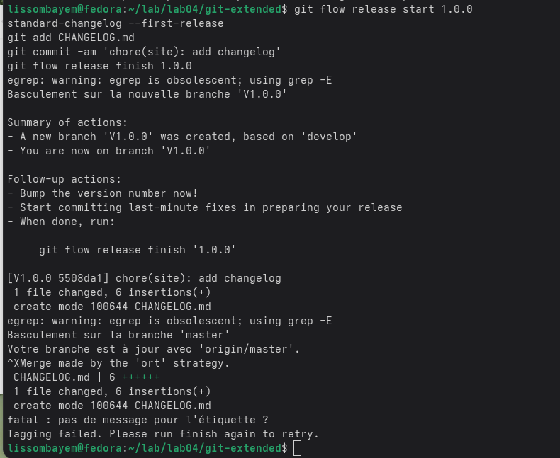

# 4. Выводы

В ходе работы были освоены Gitflow, Conventional Commits et SemVer.

# 5. Список литературы

1. Документация git-flow.
2. Спецификация Conventional Commits.
