# 1. Цель работы

Приобретение практических навыков взаимодействия пользователя с системой посредством командной строки.

# 2. Задание

1. Определить полное имя домашнего каталога.
2. Выполнить навигацию по файловой системе (cd, ls).
3. Создать и удалить каталоги (mkdir, rm, rmdir).
4. Изучить опции команд с помощью man.
5. Использовать историю команд (history).

# 3. Выполнение лабораторной работы

## 3.1. Определение домашнего каталога
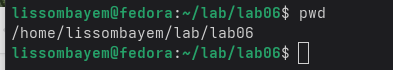

## 3.2. Исследование каталога /tmp
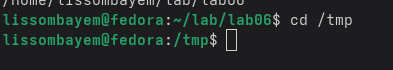
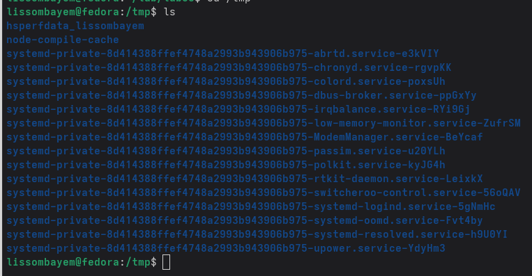
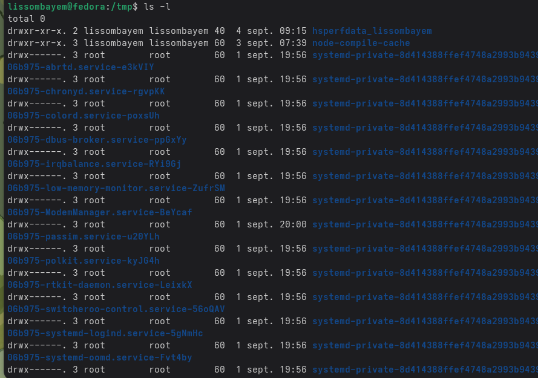
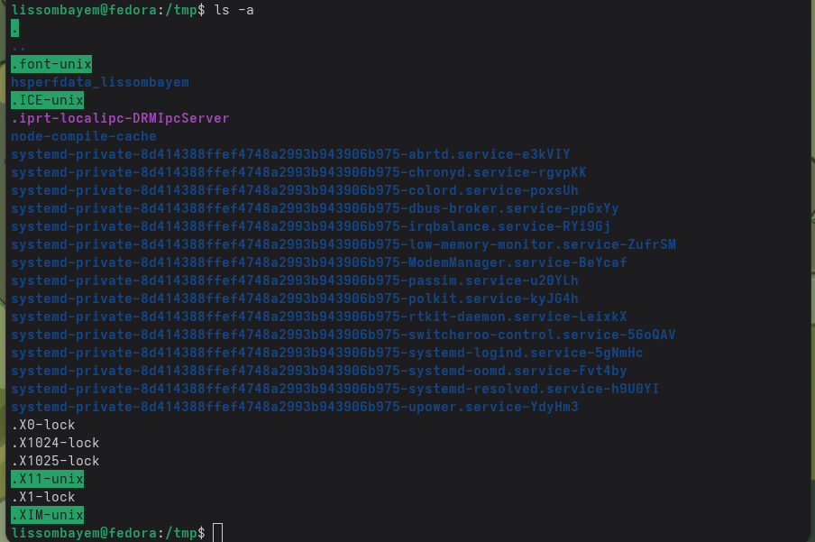
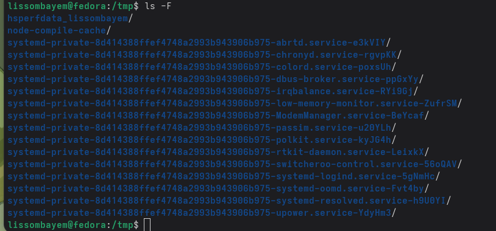

## 3.3. Возврат в домашний каталог
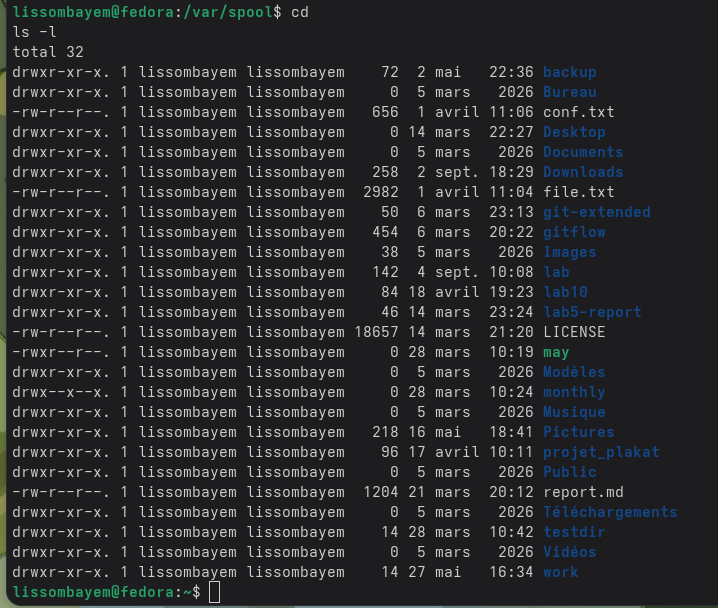

## 3.4. Создание и удаление каталогов
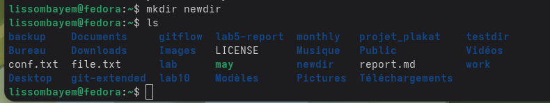

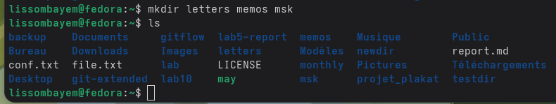
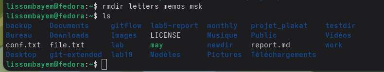

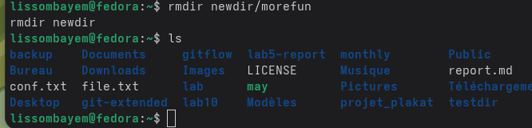

## 3.5. Страницы руководства
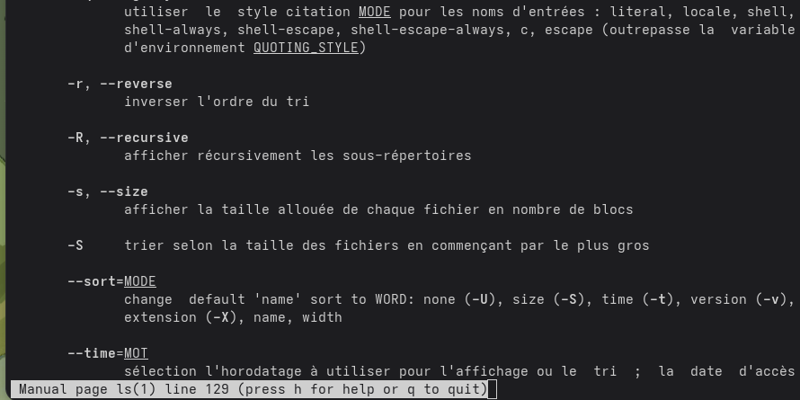
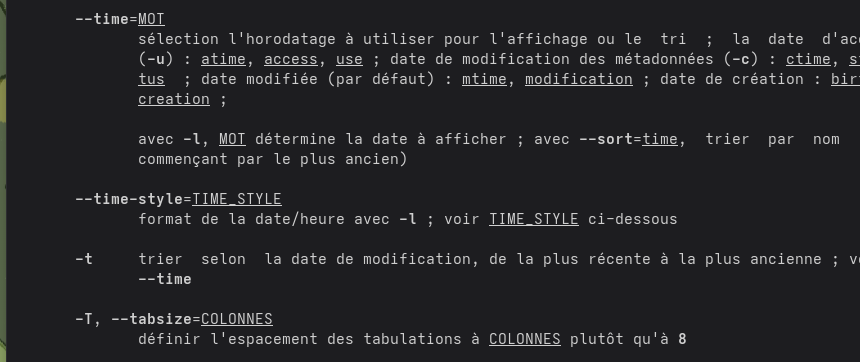

## 3.6. История команд
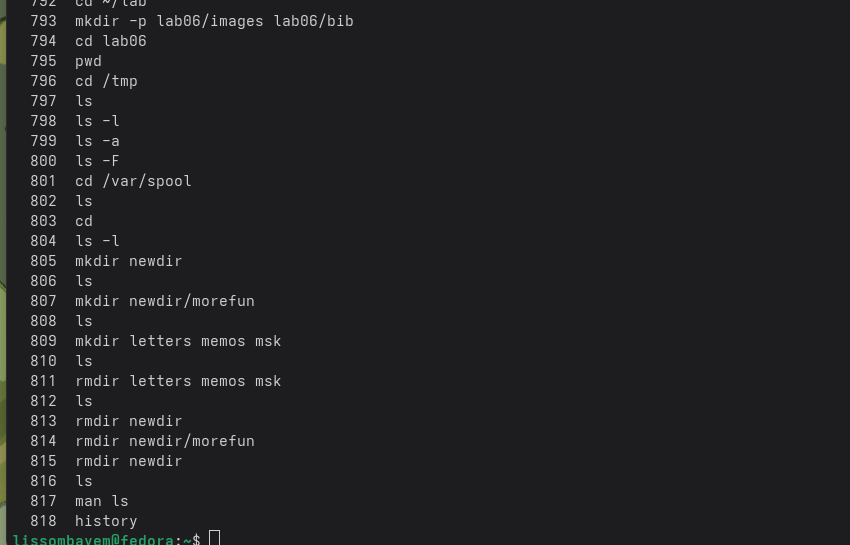
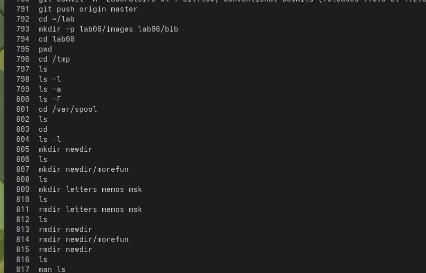

# 4. Выводы

Команды `cd`, `ls`, `mkdir`, `rmdir`, `man` и `history` являются основными инструментами для навигации, управления файлами, получения справки и повторного использования команд в системе Unix. Их освоение необходимо для эффективной работы в командной среде.

# 5. Контрольные вопросы

**1. Что такое командная строка?**  
Интерфейс для ввода текстовых команд в операционную систему.

**2. Команда для определения абсолютного пути:** `pwd`.  
Пример: `pwd` → `/home/user`.

**3. `ls -F`** показывает типы файлов (каталог `/`, исполняемый `*`, ссылка `@`).

**4. `ls -a`** отображает скрытые файлы (начинающиеся с точки `.`).

**5. Удаление файла:** `rm`; удаление каталога: `rmdir` (пустого) или `rm -r` (с содержимым).

**6. `history`** выводит список ранее выполненных команд.

**7. `!<номер>:s/старое/новое/`** – изменяет и выполняет команду из истории.

**8. `cd /tmp; ls`** (точка с запятой) позволяет выполнить несколько команд подряд.

**9. Экранирование:** `\` отменяет специальное значение символа (например, `echo \$` выведет `$`).

**10. `ls -l`** показывает: тип, права, количество ссылок, владельца, группу, размер, дату и имя.

**11. Относительный путь:** `../dir`; абсолютный: `/home/user/dir`.

**12. `man <команда>`** – получение справки.

**13. Клавиша `Tab`** – автодополнение.

# Список литературы

1. `man bash`, `man ls`, `man cd`, `man pwd`, `man mkdir`, `man rmdir`, `man rm`, `man history`.
