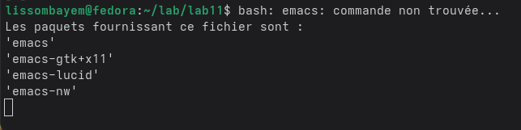
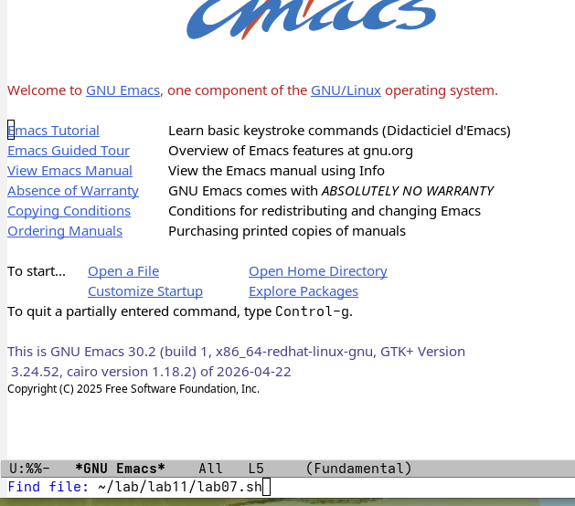

# 1. Цель работы

Познакомиться с операционной системой Linux. Получить практические навыки работы с редактором Emacs.

# 2. Задание

1. Изучить основы работы в Emacs.
2. Создать файл `lab07.sh` с использованием Emacs.
3. Выполнить основные команды: открытие, сохранение, закрытие файлов; управление буферами и окнами; поиск и замена.

# 3. Выполнение лабораторной работы

## 3.1. Запуск Emacs и создание файла

Запускаем Emacs командой `emacs &` (в фоновом режиме):



Создаём новый файл: `C-x C-f` (Ctrl+x, затем Ctrl+f), вводим имя `lab07.sh`:



## 3.2. Ввод текста

В режиме вставки вводим следующий скрипт:

```bash
#!/bin/bash
HELL=Hello
function hello {
    LOCAL HELLO=World
    echo $HELLO
}
echo $HELLO
hello
