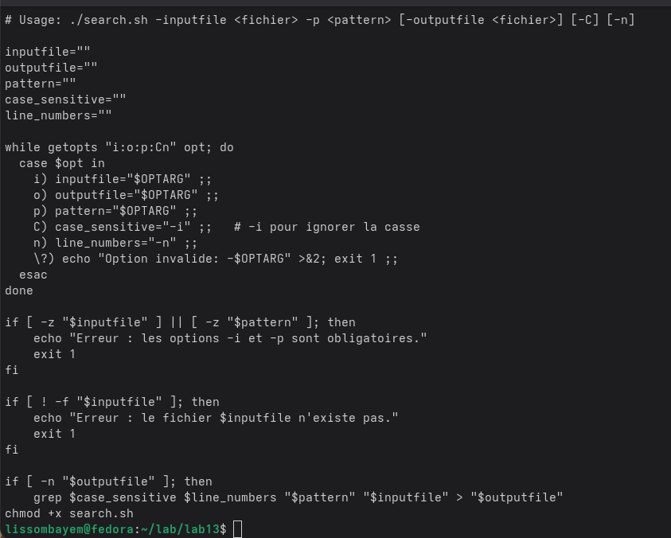
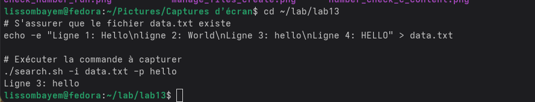
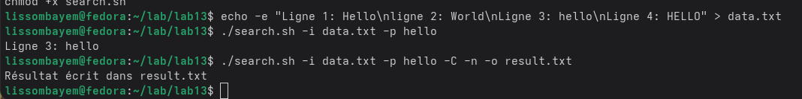
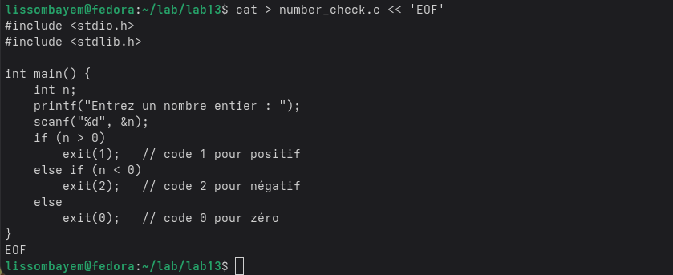
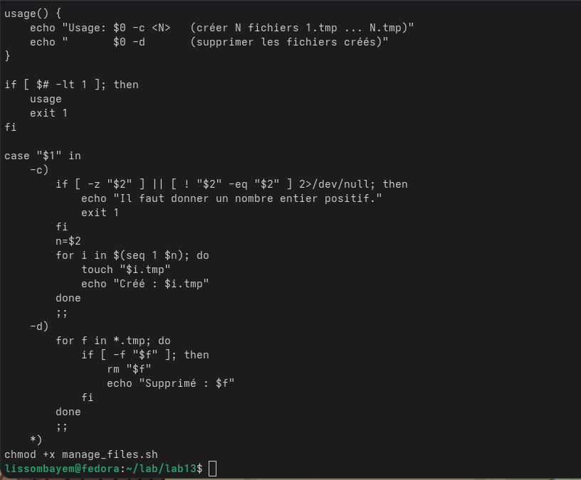
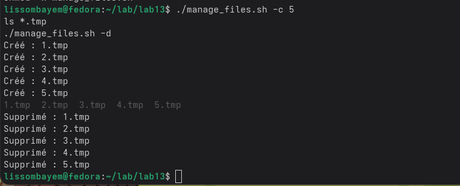
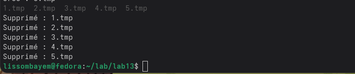
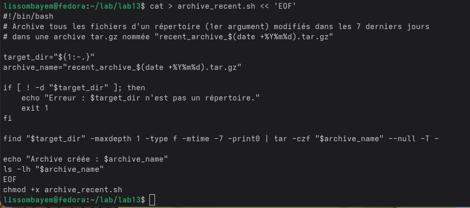
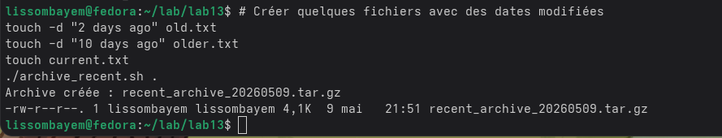

# 1. Цель работы

Изучить основы программирования в оболочке ОС UNIX. Научиться писать более сложные командные файлы с использованием логических управляющих конструкций и циклов.

# 2. Задание

1. Используя команду `getopts`, написать командный файл для разбора ключей: `-inputfile`, `-outputfile`, `-p` (шаблон), `-C` (регистронезависимость), `-n` (номера строк) и поиска строк в файле.
2. Написать программу на C, которая возвращает код завершения 0, 1 ou 2 en fonction du signe du nombre saisi, et un script shell qui analyse ce code.
3. Написать скрипт для создания/удаления пронумерованных файлов (1.tmp, 2.tmp, …).
4. Написать скрипт pour archiver les fichiers modifiés depuis moins de 7 jours avec `tar` et `find`.

# 3. Выполнение лабораторной работы

## 3.1. Анализ командной строки с getopts

Создан скрипт `search.sh`.  

Пример работы:

## 3.2. Взаимодействие с программой на C

Код `number_check.c`:

Компиляция:

Скрипт `check_number.sh`:

Выполнение:

## 3.3. Создание и удаление файлов

Скрипт `manage_files.sh`:

Создание 5 файлов:

Удаление:

## 3.4. Архивация недавно изменённых файлов

Скрипт `archive_recent.sh`:

Архивация файлов, изменённых за последние 7 дней:

# 4. Выводы

В ходе работы были освоены продвинутые приёмы программирования в bash: `getopts`, анализ кода возврата (`$?`), управление файлами в циклах, использование `find` с `-mtime` и `tar`.

# 5. Ответы на контрольные вопросы

**1. Каково предназначение команды getopts?**  
Разбор параметров командной строки.

**2. Какое отношение метасимволы имеют к генерации имён файлов?**  
Они используются для подстановки имён файлов (globbing).

**3. Какие операторы управления действиями вы знаете?**  
`if`, `case`, `for`, `while`, `until`, `break`, `continue`.

**4. Какие операторы используются для прерывания цикла?**  
`break` (выход из цикла), `continue` (следующая итерация).

**5. Для чего нужны команды false и true?**  
`true` возвращает 0 (истина), `false` – ненулевой код (ложь). Используются в циклах и условных конструкциях.

**6. Что означает строка `if test -f man\$s/\\$i.\\$s`?**  
Проверяет, является ли файл обычным файлом. Обратные слеши экранируют `$`, защищая от подстановки оболочкой.

**7. Объясните различия между конструкциями while и until.**  
`while` выполняет тело, пока условие истинно; `until` – пока условие ложно.

# Список литературы

1. Руководство `man bash`.
2. `man getopts`, `man find`, `man tar`.
