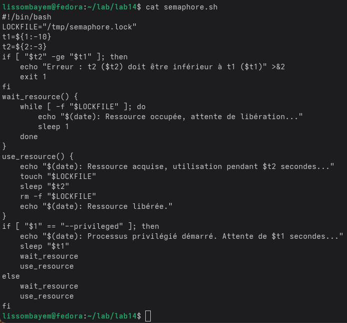
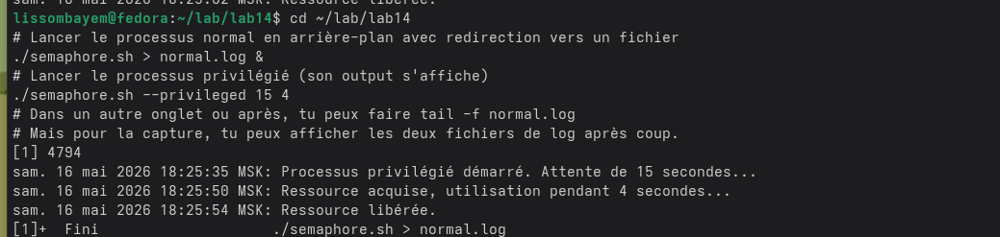
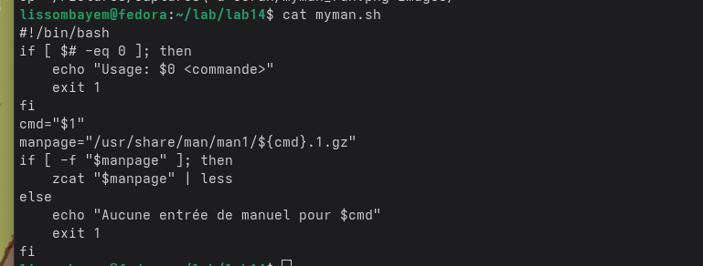
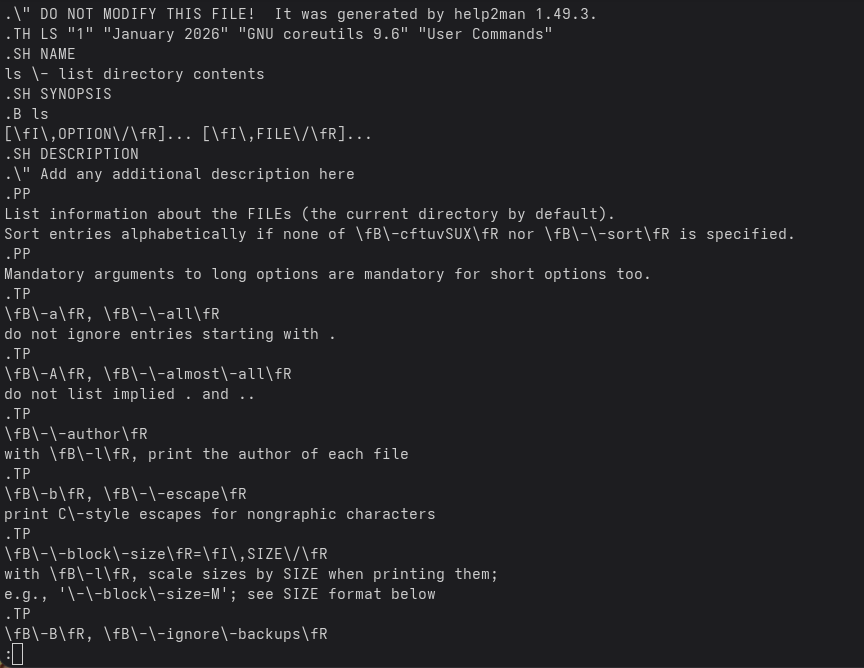
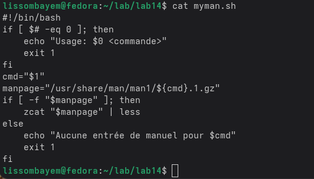
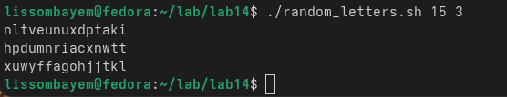

# 1. Цель работы

Изучить основы программирования в оболочке ОС UNIX. Научиться писать более сложные командные файлы с использованием логических управляющих конструкций и циклов, семафоров, обработки аргументов, генерации случайных чисел.

# 2. Задание

1. Реализовать упрощённый механизм семафоров: два процесса (один в фоне, другой в привилегированном режиме) конкурируют за ресурс с временами ожидания t1 et t2 (t2 < t1).
2. Создать аналог команды `man`, извлекающий сжатые страницы из `/usr/share/man/man1`.
3. Написать скрипт, генерирующий случайные последовательности латинских букв avec `$RANDOM`.

# 3. Выполнение лабораторной работы

## 3.1. Семафоры

Создан скрипт `semaphore.sh`.  

Запуск двух процессов (нормальный и привилегированный) :

## 3.2. Аналог `man`

Скрипт `myman.sh`  

Пример : `./myman.sh ls`

## 3.3. Генерация случайных букв

Скрипт `random_letters.sh`  

Exemple : `./random_letters.sh 15 3`

# 4. Выводы

В ходе работы были освоены продвинутые техники bash : создание блокировок (семафоров), работа со сжатыми файлами (`zcat`), использование `$RANDOM`, конкатенация строк.

# 5. Ответы на контрольные вопросы

**1. Найдите синтаксическую ошибку в строке `while [\\$1 != "exit"]`**  
Лишний обратный слеш перед `$1` ; отсутствуют пробелы ; должно быть `while [ "$1" != "exit" ]`.

**2. Как объединить несколько строк в одну?**  
Конкатенация : `str="$str$newline"`. Для вставки перевода строки : `str="$str\n$newline"`.

**3. Утилита seq и её альтернативы**  
`seq` генерирует последовательности чисел. Alternatives : `for ((i=0; i<=N; i++))`, `echo {1..10}`.

**4. Результат `$((10 / 3))`**  
3 (division entière).

**5. Отличия zsh от bash**  
Zsh : meilleure autocomplétion, correction automatique, plugins, thèmes. Bash : plus standard, présent par défaut.

**6. Синтаксис `for ((a=1; a <= LIMIT; a++))`**  
Oui, syntaxe valide.

**7. Сравнение bash с другими языками**  
Bash optimisé pour l'automatisation système, mais limité pour les calculs complexes ou structures de données.

# Список литературы

1. `man bash`, `man seq`, `man zcat`.
