# 1. Objectifs

Acquérir des compétences pratiques sur les commandes de manipulation de fichiers et répertoires sous Linux, la gestion des droits d’accès, et l’analyse des systèmes de fichiers montés.

# 2. Tâches

1.  Déterminer le nom du répertoire personnel.
2.  Explorer le contenu de `/tmp` avec différentes options de `ls`.
3.  Localiser le sous‑répertoire `cron` dans `/var/spool`.
4.  Créer et supprimer des répertoires en une seule commande.
5.  Utiliser `mkdir -p` pour créer une arborescence.
6.  Consulter les pages de manuel pour comprendre les options des commandes.
7.  Modifier les droits d’accès avec `chmod`.
8.  Analyser l’espace disque avec `df` et les systèmes montés avec `mount`.
9.  Utiliser `history` pour modifier et réexécuter des commandes.

# 3. Exécution du laboratoire

## 3.1. Détermination du répertoire personnel

La commande `pwd` affiche le répertoire courant :

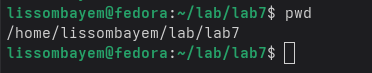{#fig:pwd}

## 3.2. Exploration du répertoire `/tmp`

En utilisant `cd /tmp` puis `ls`, on obtient la liste des fichiers :

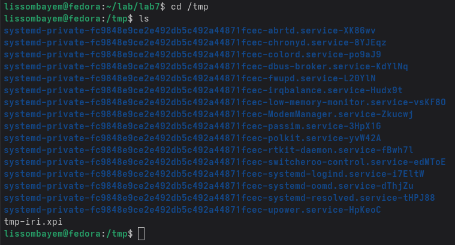{#fig:lstmp}

Avec `ls -l`, on obtient des informations détaillées (droits, taille, date) :

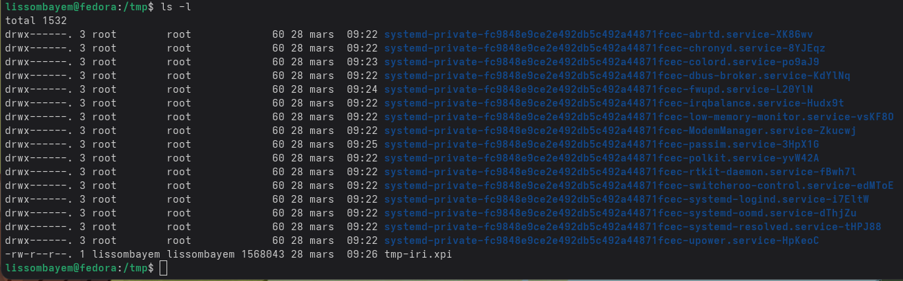{#fig:lsltmp}

`ls -F` ajoute un symbole pour indiquer le type de fichier :

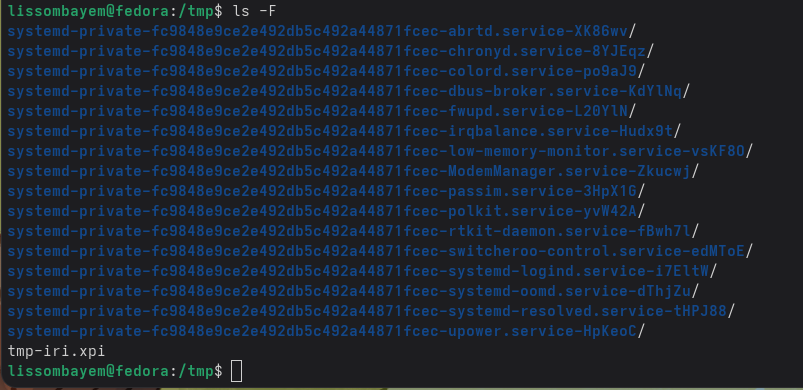{#fig:lsF}

`ls -a` montre également les fichiers cachés (commençant par `.`) :

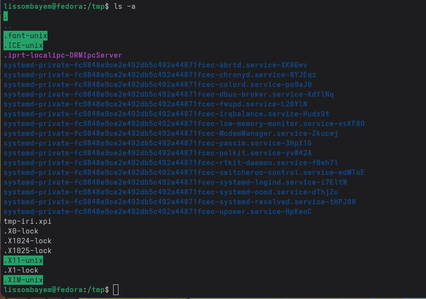{#fig:lsa}

## 3.3. Localisation du sous‑répertoire `cron`

Dans `/var/spool`, on trouve le répertoire `cron` :

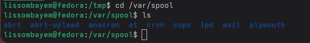{#fig:cron}

## 3.4. Propriétaires des fichiers dans le répertoire personnel

De retour dans `~`, `ls -l` indique le propriétaire de chaque élément :

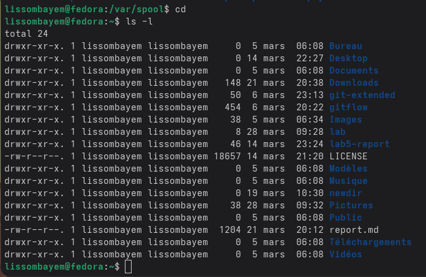{#fig:owner}

## 3.5. Création d’une arborescence avec `mkdir -p`

La commande `mkdir -p newdir/morefun` crée les deux répertoires en une seule fois :

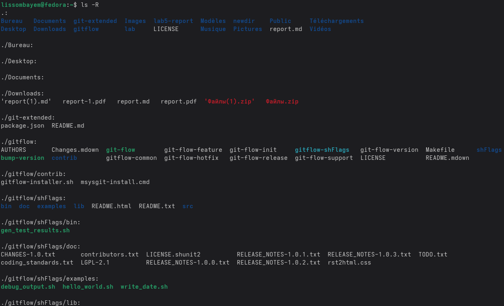{#fig:mkdirp}

## 3.6. Création et suppression de plusieurs répertoires

Création de `letters`, `memos`, `misk` :

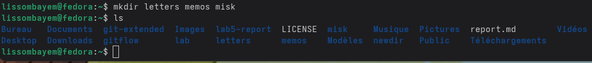{#fig:mkdirMulti}

Suppression avec `rmdir` :

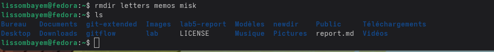{#fig:rmdirMulti}

Suppression récursive avec `rmdir -p` :

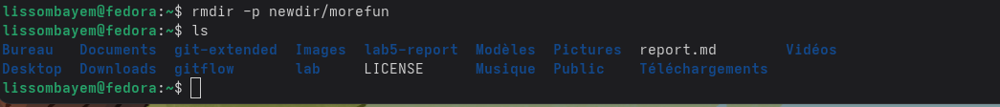{#fig:rmdirp}

## 3.7. Utilisation des pages de manuel

### 3.7.1. Commande `ls`
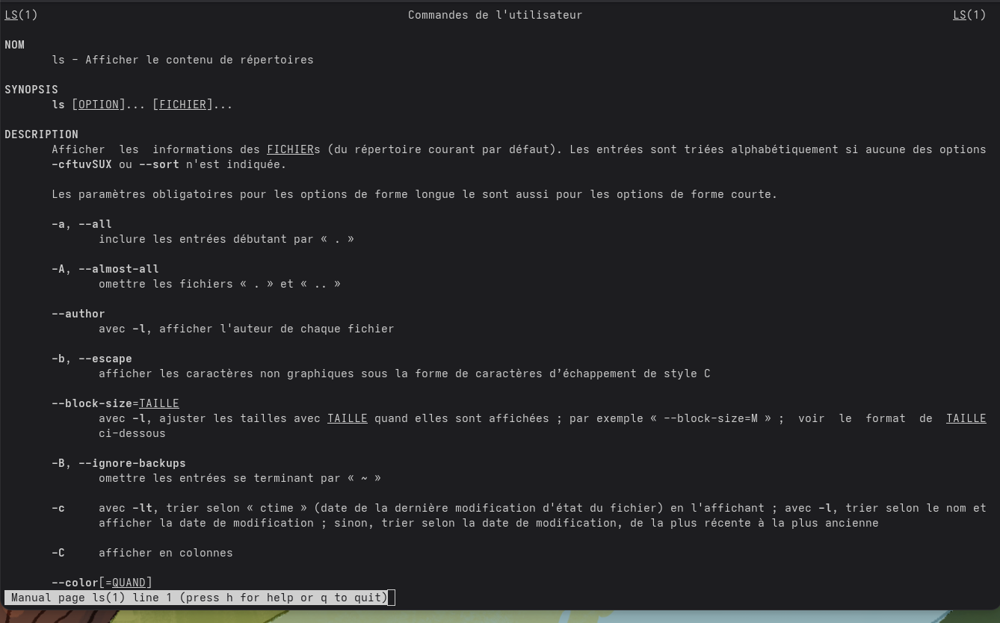{#fig:manLs}

### 3.7.2. Commande `cd`
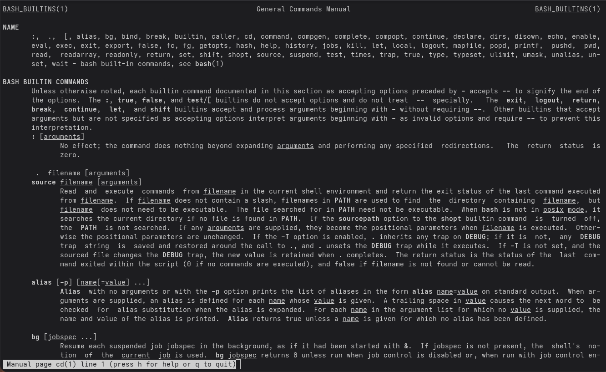{#fig:manCd}

### 3.7.3. Commande `pwd`
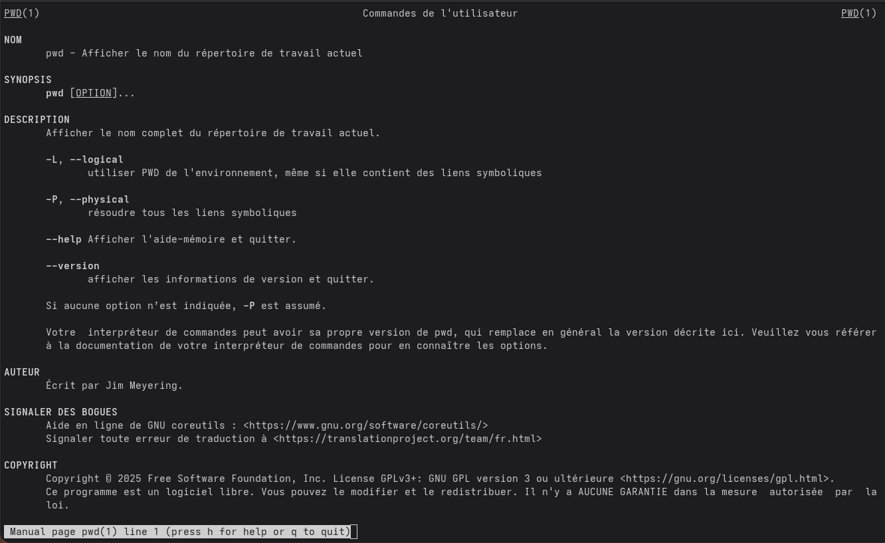{#fig:manPwd}

### 3.7.4. Commande `mkdir`
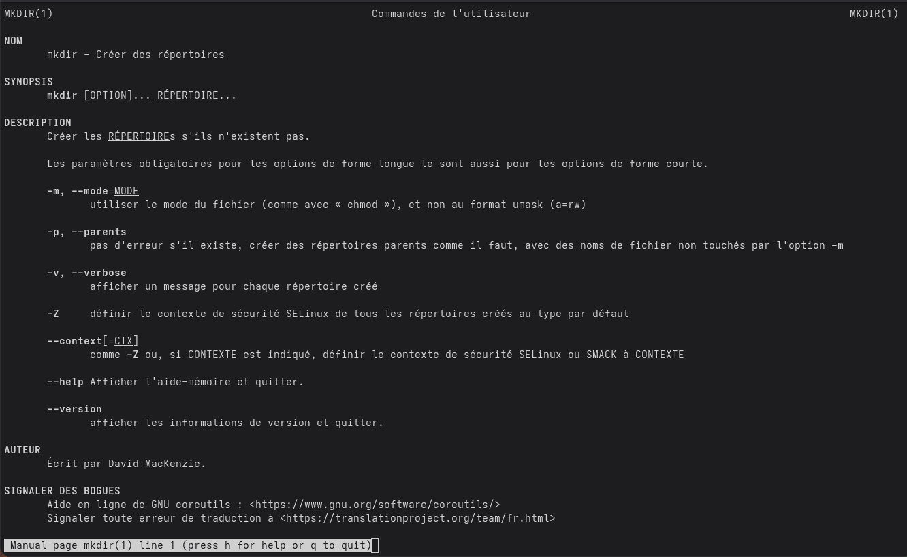{#fig:manMkdir}

### 3.7.5. Commande `rmdir`
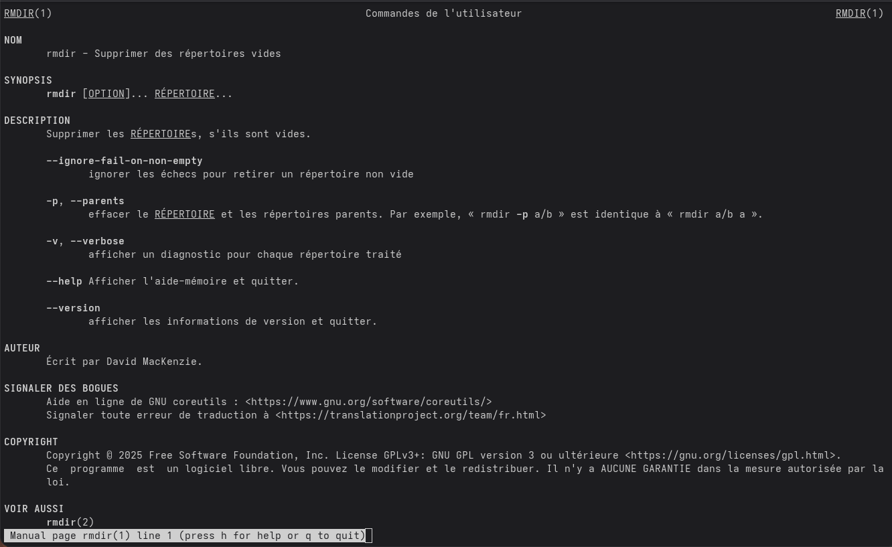{#fig:manRmdir}

### 3.7.6. Commande `rm`
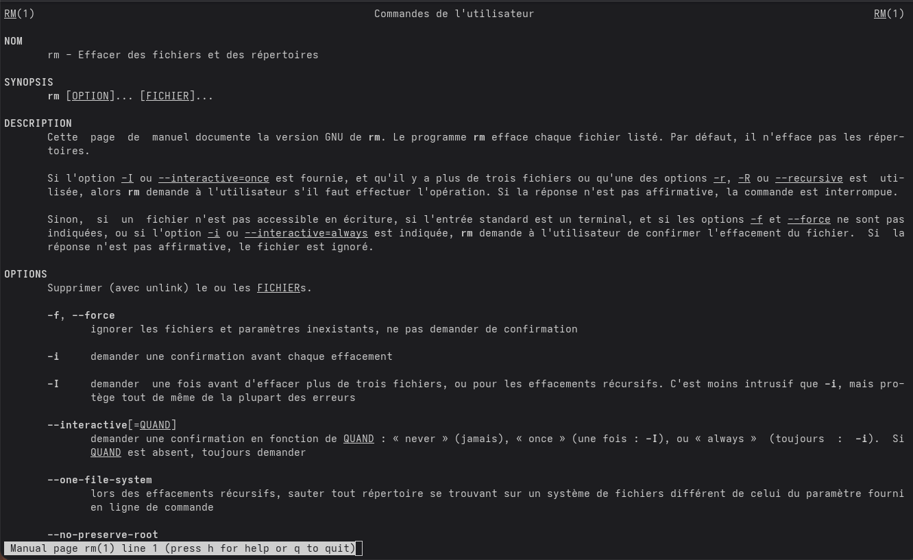{#fig:manRm}

### 3.7.7. Commande `cp`
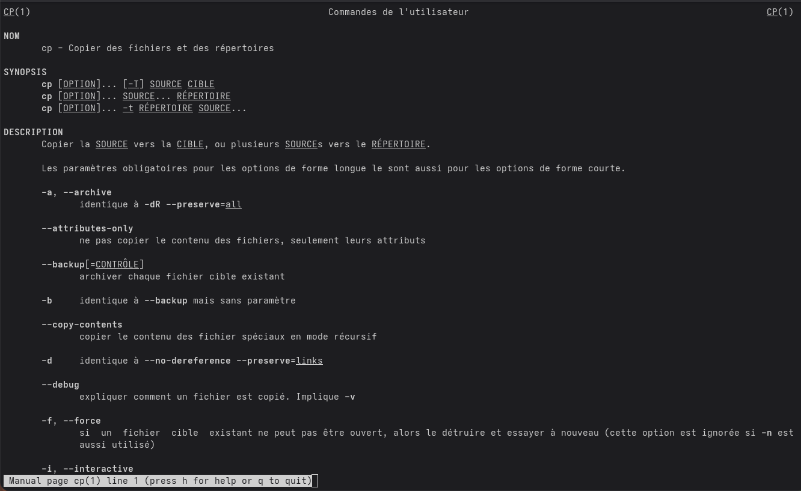{#fig:manCp}

### 3.7.8. Commande `mv`
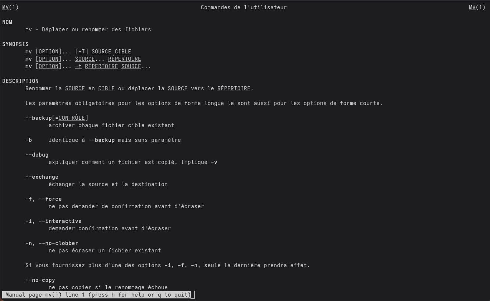{#fig:manMv}

### 3.7.9. Commande `chmod`
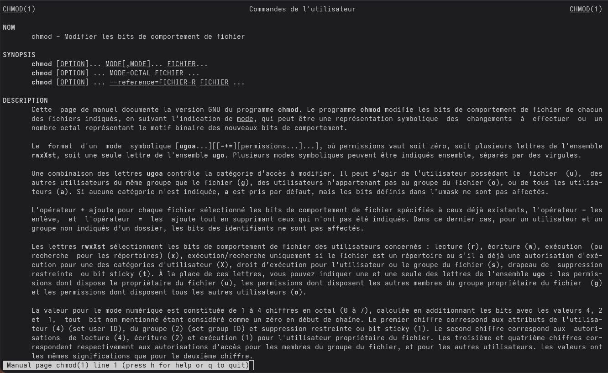{#fig:manChmod}

## 3.8. Gestion des droits d’accès

Création d’un fichier `may` :

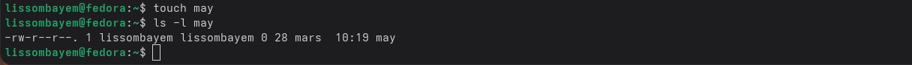{#fig:touchMay}

Ajout du droit d’exécution pour le propriétaire :

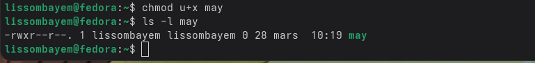{#fig:chmodUx}

Création d’un répertoire `monthly` avec restriction de lecture pour le groupe et les autres :

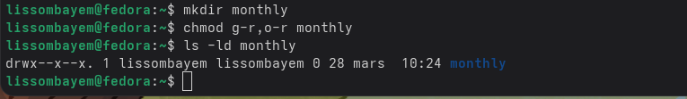{#fig:chmodMonthly}

## 3.9. Analyse de l’espace disque et des points de montage

`df -h` donne l’espace disque disponible :

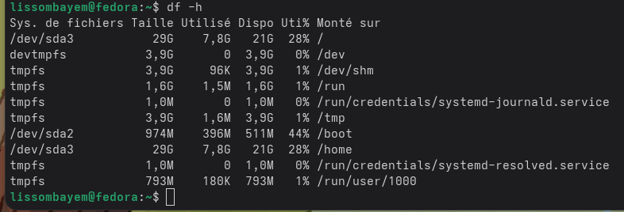{#fig:df}

`mount` liste les systèmes de fichiers montés :

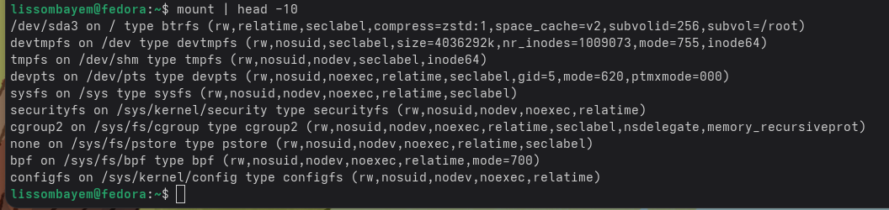{#fig:mount}

Contenu du fichier `/etc/fstab` (si accessible) :

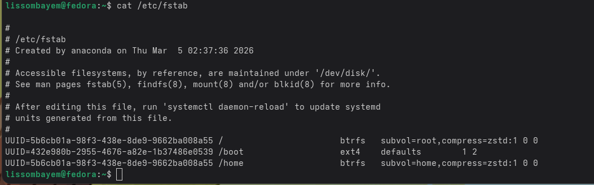{#fig:fstab}

## 3.10. Utilisation de l’historique des commandes

La commande `history` affiche les dernières commandes tapées :

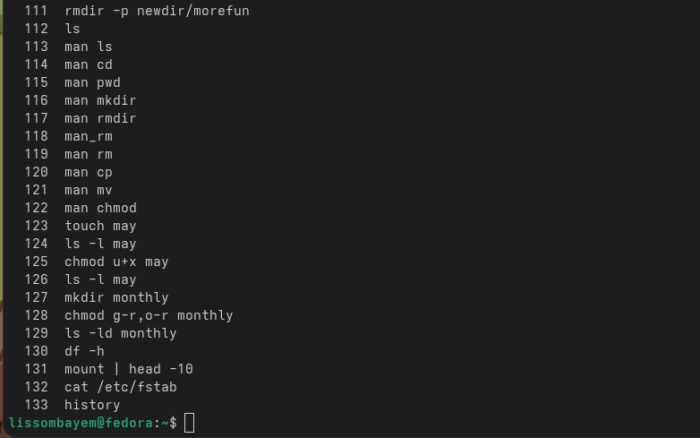{#fig:history}

On peut modifier une commande de l’historique et l’exécuter. Par exemple, remplacer `newdir` par `testdir` :

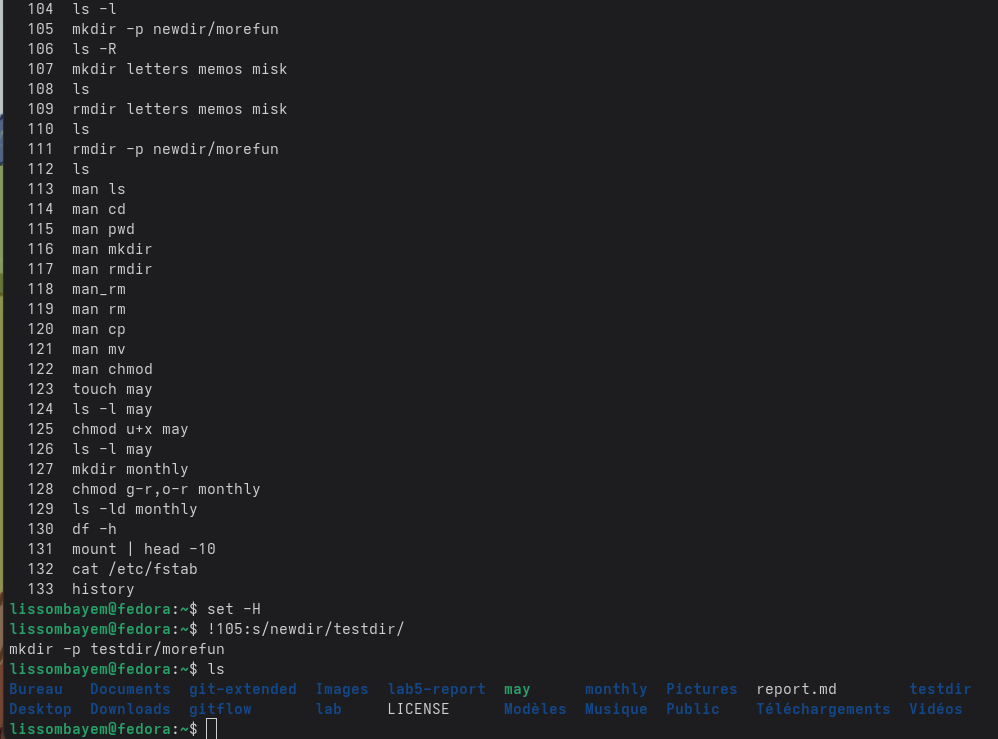{#fig:historyModif}

# 4. Conclusions

Ce laboratoire a permis de maîtriser les commandes essentielles de gestion des fichiers et répertoires sous Linux (touch, cat, less, cp, mv, mkdir, rmdir, rm), d’utiliser les pages de manuel pour découvrir les options, de modifier les droits d’accès avec `chmod`, d’analyser l’espace disque et les systèmes montés, et d’exploiter l’historique pour gagner en efficacité.

# 5. Réponses aux questions

**8. Quelles sont les principales possibilités de la commande `mv` sous Linux ?**  
`mv` permet de déplacer ou de renommer des fichiers et des répertoires. Ses principales options sont :  
- `-i` : demande confirmation avant d’écraser un fichier existant.  
- `-u` : ne déplace que si la source est plus récente ou si la destination manque.  
- `-v` : affiche les actions effectuées.  

**9. Que sont les droits d’accès ? Comment peuvent-ils être modifiés ?**  
Les droits d’accès définissent les permissions de lecture (`r`), écriture (`w`) et exécution (`x`) pour le propriétaire, le groupe et les autres utilisateurs.  
Ils sont modifiés avec `chmod`, en notation symbolique (ex: `chmod u+x fichier`) ou octale (ex: `chmod 755 fichier`).  

# Références

1. Architecture des ordinateurs et systèmes d’exploitation – cours.
2. Pages de manuel Linux (`man ls`, `man mv`, `man chmod`, etc.).
