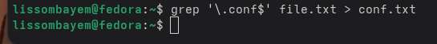
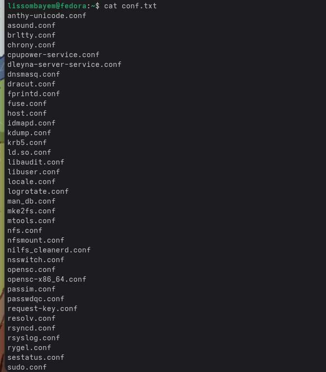
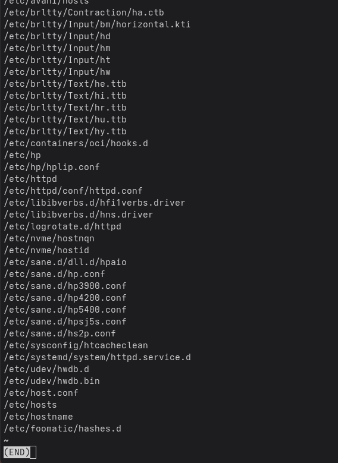
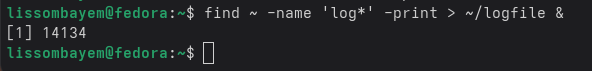
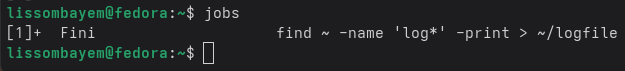
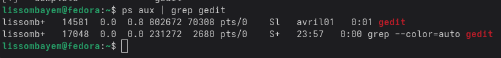
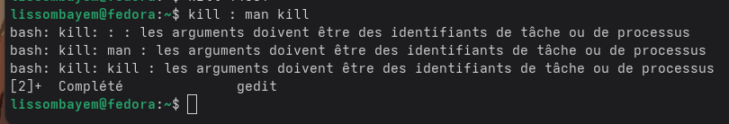
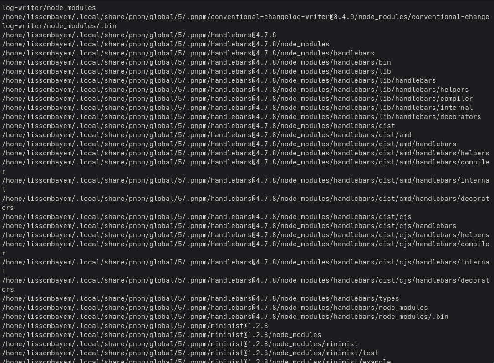
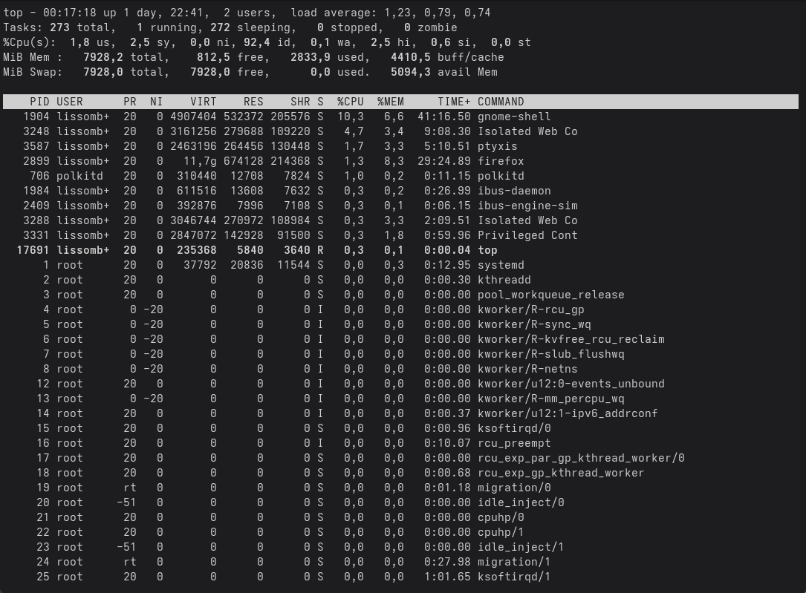

# 1. Цель работы

Ознакомление с инструментами поиска файлов и фильтрации текстовых данных. Приобретение практических навыков: по управлению процессами (и заданиями), по проверке использования диска и обслуживанию файловых систем.

# 2. Задание

1. Записать в файл `file.txt` названия файлов, содержащихся в каталоге `/etc`. Дописать в этот же файл названия файлов, содержащихся в вашем домашнем каталоге.
2. Вывести имена всех файлов из `file.txt`, имеющих расширение `.conf`, после чего записать их в новый текстовой файл `conf.txt`.
3. Определить, какие файлы в вашем домашнем каталоге имеют имена, начинающиеся с символа `c`. Предложить несколько вариантов, как это сделать.
4. Вывести на экран (постранично) имена файлов из каталога `/etc`, начинающиеся с символа `h`.
5. Запустить в фоновом режиме процесс, который будет записывать в файл `~/logfile` файлы, имена которых начинаются с `log`.
6. Удалить файл `~/logfile`.
7. Запустить из консоли в фоновом режиме редактор `gedit`.
8. Определить идентификатор процесса `gedit`, используя команду `ps`, конвейер и фильтр `grep`. Как ещё можно определить идентификатор процесса?
9. Изучить справку (`man`) команды `kill`, после чего использовать её для завершения процесса `gedit`.
10. Выполнить команды `df` и `du`, предварительно получив более подробную информацию об этих командах с помощью `man`.
11. Воспользовавшись справкой команды `find`, вывести имена всех директорий, имеющихся в вашем домашнем каталоге.

# 3. Выполнение лабораторной работы

## 3.1. Перенаправление ввода-вывода

Сначала записываем список файлов каталога `/etc` в файл `file.txt` с помощью перенаправления `>`:

Затем добавляем список файлов домашнего каталога в конец того же файла, используя `>>`:

## 3.2. Фильтрация текста с помощью `grep`

Извлекаем строки, оканчивающиеся на `.conf`, и сохраняем их в `conf.txt`:

Проверяем содержимое `conf.txt` командой `cat`:

## 3.3. Поиск файлов по шаблону в домашнем каталоге

Выводим имена файлов, начинающихся с `c`, с помощью `ls -d ~/c*`:

## 3.4. Постраничный вывод результатов поиска

Ищем в каталоге `/etc` файлы, имена которых начинаются с `h`, и выводим постранично через `less`:

## 3.5. Запуск процесса в фоновом режиме

Запускаем поиск файлов, начинающихся с `log`, и записываем результат в `~/logfile` в фоне:

Команда `jobs` показывает список фоновых задач:

Удаляем созданный файл `~/logfile`:

## 3.6. Управление процессом `gedit`

Запускаем `gedit` в фоновом режиме:

Определяем PID процесса `gedit` с помощью `ps aux | grep gedit`:

Завершаем процесс командой `kill <PID>` (вместо `<PID>` подставляем реальный номер):

## 3.7. Изучение справочных страниц

Команда `man kill` показывает опции утилиты `kill`:

Аналогично изучаем  `man du`, `man find` (на экране — пример для `df`):

## 3.8. Анализ использования диска

`df -h` показывает размер каждого смонтированного раздела:

`du -sh ~` показывает объём, занимаемый домашним каталогом:

## 3.9. Вывод всех подкаталогов домашнего каталога

С помощью `find ~ -type d` перечисляем все директории (включая поддиректории):

## 3.10. (Дополнительно) Утилиты `top` и `htop`

`top` отображает динамический список процессов:

# 4. Выводы

В ходе выполнения лабораторной работы были освоены: перенаправление потоков ввода-вывода (`>`, `>>`), использование конвейеров (`|`), поиск файлов с помощью `find` и `grep`, управление процессами (фоновый режим, `jobs`, `kill`), а также анализ дискового пространства (`df`, `du`). Полученные навыки необходимы для эффективной работы в командной строке Linux.

# 5. Ответы на контрольные вопросы

1. **Какие потоки ввода-вывода вы знаете?**  
   stdin (0) — стандартный ввод (клавиатура), stdout (1) — стандартный вывод (экран), stderr (2) — стандартный вывод ошибок (экран).

2. **Объясните разницу между операциями `>` и `>>`.**  
   `>` перенаправляет stdout в файл, перезаписывая его; `>>` добавляет вывод в конец файла.

3. **Что такое конвейер (pipe)?**  
   Конвейер (`|`) соединяет stdout одной команды с stdin следующей.

4. **Что такое процесс? Чем он отличается от программы?**  
   Программа — это исполняемый файл; процесс — экземпляр выполняющейся программы с собственной областью памяти и контекстом.

5. **Что такое PID и GID?**  
   PID (Process ID) — уникальный идентификатор процесса; GID (Group ID) — идентификатор группы владельца.

6. **Что такое задания (jobs) и какая команда позволяет ими управлять?**  
   Задание — процесс, запущенный из оболочки. Команда `jobs` выводит список заданий; `fg`, `bg`, `kill` управляют ими.

7. **Найдите информацию об утилитах `top` и `htop`. Каковы их функции?**  
   `top` показывает активные процессы в реальном времени; `htop` — улучшенная версия с интерактивным интерфейсом.

8. **Назовите и дайте характеристику команде поиска файлов. Приведите примеры использования.**  
   `find` — рекурсивный поиск по критериям (имя, тип, размер и т.д.). Примеры: `find ~ -name "*.txt"`, `find / -type d -name "backup"`.

9. **Можно ли по контексту (содержанию) найти файл? Если да, то как?**  
   Да, с помощью `grep -r "шаблон" /путь` (рекурсивный поиск внутри файлов) или `find ... -exec grep ... {} \;`.

10. **Как определить объём свободной памяти на жёстком диске?**  
    Командой `df -h`.

11. **Как определить объём вашего домашнего каталога?**  
    Командой `du -sh ~`.

12. **Как удалить зависший процесс?**  
    Использовать `kill <PID>` или `kill -9 <PID>` для принудительного завершения.

# Список литературы

1. Страницы руководства Linux (`man find`, `man grep`, `man ps`, `man kill`, `man df`, `man du`, `man top`, `man htop`).
2. Курс «Архитектура компьютеров и операционные системы».
